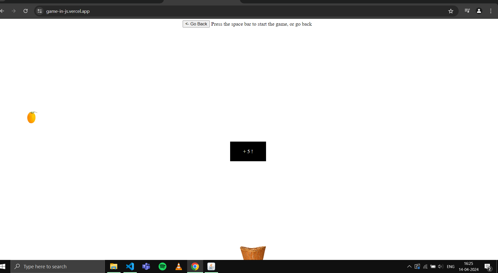

<h1>A Test Car Game for me</h1>

  I am making this game for learning purpose, will be trying to implement a simple car game with basic features turning, moving forward and reverse. A brief list of objectives is written below.
  <ol>
    <li>Go forward</li>
    <li>Make a left turn</li>
    <li>Make a right turn</li>
    <li>Go backwards (reverse)</li>
  </ol>
  Upon completion of the above will see make the game more intense.

 

  As above is completed let's change the game to bucket collector, that will collect fruits in a basket. Guess car game would require certain graphics so keeping Meed of Skeed on Hold :).

  The above objective is complete as well, now lets move on to make a reviews application.

Will deploy on vercel or AWS EC2 on an Apache server
<a href="https://game-in-js.vercel.app/">Vercel App Link</a>

  
  
  
  
  
  

